# Roadmap

Good First Token v1, in build order. The design is in [docs/specs/v1.md](docs/specs/v1.md).
Every item below is a GitHub issue labeled `roadmap`, sized for one agent session, local or in the
cloud, and written so the session needs only this repo.

## Picking up an item

1. Choose an open issue whose blockers are all closed. Each issue lists its blockers, and GitHub shows
   them in the issue's sidebar. Lower numbers come first.
2. Say you're on it, by assigning yourself or leaving a comment, so two sessions don't collide.
3. Read the spec sections the issue links, then [AGENTS.md](AGENTS.md) and [CONTRIBUTING.md](CONTRIBUTING.md).
4. Open one PR for the issue, with `Closes #<number>` in the description. The rules it builds move into
   `docs/how-it-works.md` in the same PR. Once the PR is open, add its number to the item's **Done in**
   column below.

The **Done in** column links the PR that closed each finished item. Several items can usually run at the
same time.

## M1 Foundation

The workspace, shared schemas, database, GitHub fake, design system, and security scans every other issue builds on.

| Issue | Item | Blocked by | Done in |
|---|---|---|---|
| [#3](https://github.com/meanwhileso/goodfirsttoken/issues/3) | Scaffold the workspace, the Workers app, and CI | Nothing | [#37](https://github.com/meanwhileso/goodfirsttoken/pull/37) |
| [#4](https://github.com/meanwhileso/goodfirsttoken/issues/4) | Define the core schemas and the claim state machine | #3 | [#41](https://github.com/meanwhileso/goodfirsttoken/pull/41) |
| [#5](https://github.com/meanwhileso/goodfirsttoken/issues/5) | Add the D1 schema and data access | #4 | [#48](https://github.com/meanwhileso/goodfirsttoken/pull/48) |
| [#6](https://github.com/meanwhileso/goodfirsttoken/issues/6) | Build the recorded GitHub fake and the sample data | #3 | [#46](https://github.com/meanwhileso/goodfirsttoken/pull/46) |
| [#7](https://github.com/meanwhileso/goodfirsttoken/issues/7) | Build the design system in code and the /design page | #3 | [#47](https://github.com/meanwhileso/goodfirsttoken/pull/47) |
| [#39](https://github.com/meanwhileso/goodfirsttoken/issues/39) | Run security scans on every PR and every week | #3 | [#44](https://github.com/meanwhileso/goodfirsttoken/pull/44) |

## M2 Sign-in

GitHub sign-in on the site and the MCP server with OAuth 2.1.

| Issue | Item | Blocked by | Done in |
|---|---|---|---|
| [#8](https://github.com/meanwhileso/goodfirsttoken/issues/8) | Add GitHub sign-in on the site and the permission checks | #5, #6 | [#51](https://github.com/meanwhileso/goodfirsttoken/pull/51) |
| [#9](https://github.com/meanwhileso/goodfirsttoken/issues/9) | Serve the MCP server with OAuth 2.1 and a connected-agents list | #8 | [#52](https://github.com/meanwhileso/goodfirsttoken/pull/52) |

## M3 Projects

Maintainers register projects, admins approve them, and tagged issues sync from GitHub.

| Issue | Item | Blocked by | Done in |
|---|---|---|---|
| [#10](https://github.com/meanwhileso/goodfirsttoken/issues/10) | Let maintainers register and manage a project | #9 | [#55](https://github.com/meanwhileso/goodfirsttoken/pull/55) |
| [#11](https://github.com/meanwhileso/goodfirsttoken/issues/11) | Add the admin queue, pages, and tools | #10 | [#60](https://github.com/meanwhileso/goodfirsttoken/pull/60) |
| [#12](https://github.com/meanwhileso/goodfirsttoken/issues/12) | Sync tagged issues and linked PRs from GitHub | #10 | [#59](https://github.com/meanwhileso/goodfirsttoken/pull/59) |

## M4 Claims and live feeds

Claims, live updates, feeds, submitting work, and following PRs.

| Issue | Item | Blocked by | Done in |
|---|---|---|---|
| [#13](https://github.com/meanwhileso/goodfirsttoken/issues/13) | Build the issue room: claims, updates, and live watchers | #5 | [#50](https://github.com/meanwhileso/goodfirsttoken/pull/50) |
| [#14](https://github.com/meanwhileso/goodfirsttoken/issues/14) | Fan events out to repo, user, and homepage feeds, with text streams | #13 | [#53](https://github.com/meanwhileso/goodfirsttoken/pull/53) |
| [#15](https://github.com/meanwhileso/goodfirsttoken/issues/15) | Add the donor tools for sessions, suggestions, and claims | #9, #12, #13 | [#63](https://github.com/meanwhileso/goodfirsttoken/pull/63) |
| [#16](https://github.com/meanwhileso/goodfirsttoken/issues/16) | Submit work: branch or fork, a signed commit, and the PR | #15 | [#74](https://github.com/meanwhileso/goodfirsttoken/pull/74) |
| [#17](https://github.com/meanwhileso/goodfirsttoken/issues/17) | Follow PRs to the end and bring review comments back | #16 | [#78](https://github.com/meanwhileso/goodfirsttoken/pull/78) |
| [#87](https://github.com/meanwhileso/goodfirsttoken/issues/87) | Bring back a maintainer's comments in a PR's conversation as follow-ups | #17 | |
| [#88](https://github.com/meanwhileso/goodfirsttoken/issues/88) | Let a donor settle a follow-up without a fix | #17 | |

## M5 Skills and harnesses

The skills and plugins, install for every harness, and MCP Apps views.

| Issue | Item | Blocked by | Done in |
|---|---|---|---|
| [#18](https://github.com/meanwhileso/goodfirsttoken/issues/18) | Build every skill from one source, and publish the plugins | #3 | [#42](https://github.com/meanwhileso/goodfirsttoken/pull/42) |
| [#19](https://github.com/meanwhileso/goodfirsttoken/issues/19) | Write the donor skills: give, work, and review | #18, #17 | [#96](https://github.com/meanwhileso/goodfirsttoken/pull/96) |
| [#20](https://github.com/meanwhileso/goodfirsttoken/issues/20) | Write the maintainer and admin skills | #18, #11 | [#68](https://github.com/meanwhileso/goodfirsttoken/pull/68) |
| [#21](https://github.com/meanwhileso/goodfirsttoken/issues/21) | Serve /start.md, document every harness, and add the token hook | #19 | |
| [#22](https://github.com/meanwhileso/goodfirsttoken/issues/22) | Add MCP Apps views for issue cards, the live feed, and the review queue | #7, #14, #16 | [#79](https://github.com/meanwhileso/goodfirsttoken/pull/79) |
| [#70](https://github.com/meanwhileso/goodfirsttoken/issues/70) | Let maintainers ask to be removed from their agent | #20 | [#75](https://github.com/meanwhileso/goodfirsttoken/pull/75) |
| [#80](https://github.com/meanwhileso/goodfirsttoken/issues/80) | Tell a maintainer when the sync delisted their project | #70 | [#82](https://github.com/meanwhileso/goodfirsttoken/pull/82) |
| [#86](https://github.com/meanwhileso/goodfirsttoken/issues/86) | Show the whole follow-up in the review queue view | #17 | |

## M6 Public site

Every public page, the markdown and JSON versions, and share cards.

| Issue | Item | Blocked by | Done in |
|---|---|---|---|
| [#23](https://github.com/meanwhileso/goodfirsttoken/issues/23) | Build the homepage | #7, #14 | [#54](https://github.com/meanwhileso/goodfirsttoken/pull/54) |
| [#24](https://github.com/meanwhileso/goodfirsttoken/issues/24) | Build the projects list and the project pages | #7, #12, #14 | [#62](https://github.com/meanwhileso/goodfirsttoken/pull/62) |
| [#25](https://github.com/meanwhileso/goodfirsttoken/issues/25) | Build the issue page with live lanes | #7, #14 | [#56](https://github.com/meanwhileso/goodfirsttoken/pull/56) |
| [#26](https://github.com/meanwhileso/goodfirsttoken/issues/26) | Build person pages, the leaderboard, and /live | #7, #14, #17 | |
| [#27](https://github.com/meanwhileso/goodfirsttoken/issues/27) | Build /me and /maintainers | #7, #9, #16 | [#90](https://github.com/meanwhileso/goodfirsttoken/pull/90) |
| [#28](https://github.com/meanwhileso/goodfirsttoken/issues/28) | Serve markdown versions, llms.txt, and the JSON data | #23, #24, #25, #26, #27 | |
| [#29](https://github.com/meanwhileso/goodfirsttoken/issues/29) | Generate share cards | #26 | |
| [#65](https://github.com/meanwhileso/goodfirsttoken/issues/65) | Delist a paused project whose repo went private | #24 | [#73](https://github.com/meanwhileso/goodfirsttoken/pull/73) |
| [#94](https://github.com/meanwhileso/goodfirsttoken/issues/94) | Word /me's refusals for the person reading them | #27 | |
| [#95](https://github.com/meanwhileso/goodfirsttoken/issues/95) | Show follow-ups and claims in progress on /me | #27 | |

## M7 Policy crawler

Finding projects whose own docs welcome AI, and keeping listings current.

| Issue | Item | Blocked by | Done in |
|---|---|---|---|
| [#30](https://github.com/meanwhileso/goodfirsttoken/issues/30) | Crawl for written AI policies and queue candidates for admins | #11 | [#69](https://github.com/meanwhileso/goodfirsttoken/pull/69) |
| [#31](https://github.com/meanwhileso/goodfirsttoken/issues/31) | Re-crawl listed projects and pause on negative signals | #30 | [#81](https://github.com/meanwhileso/goodfirsttoken/pull/81) |
| [#76](https://github.com/meanwhileso/goodfirsttoken/issues/76) | Catch the policy wordings the crawler misses | #30 | |
| [#77](https://github.com/meanwhileso/goodfirsttoken/issues/77) | Read fewer welcoming policies as bans | #76 | |
| [#98](https://github.com/meanwhileso/goodfirsttoken/issues/98) | Show pauses and policy changes on /admin | #31 | |

## M8 Launch readiness

Deploys, the static host, a security review, and the launch video.

| Issue | Item | Blocked by | Done in |
|---|---|---|---|
| [#32](https://github.com/meanwhileso/goodfirsttoken/issues/32) | Write the deploy workflow and the self-hosting guide | #3 | [#43](https://github.com/meanwhileso/goodfirsttoken/pull/43) |
| [#33](https://github.com/meanwhileso/goodfirsttoken/issues/33) | Serve static assets from R2 with no cookies | #32, #7 | [#49](https://github.com/meanwhileso/goodfirsttoken/pull/49) |
| [#34](https://github.com/meanwhileso/goodfirsttoken/issues/34) | Run a security review before launch and fix what it finds | #17, #21, #28, #31, #33 | |
| [#35](https://github.com/meanwhileso/goodfirsttoken/issues/35) | Re-render the launch video to match the live site | #23, #25 | [#57](https://github.com/meanwhileso/goodfirsttoken/pull/57) |
| [#89](https://github.com/meanwhileso/goodfirsttoken/issues/89) | Check on GitHub that a private organization member's review counts | #17 | |
| [#91](https://github.com/meanwhileso/goodfirsttoken/issues/91) | Fold synced issue titles, and keep the update fold fast | Nothing | [#97](https://github.com/meanwhileso/goodfirsttoken/pull/97) |
| [#92](https://github.com/meanwhileso/goodfirsttoken/issues/92) | Tie each project to its GitHub repo ID | Nothing | [#99](https://github.com/meanwhileso/goodfirsttoken/pull/99) |
| [#93](https://github.com/meanwhileso/goodfirsttoken/issues/93) | Cap the GitHub reads behind the admin queue | Nothing | |

## Dependency graph

An arrow points from an item to the items it unblocks. Colors mark milestones: M1 Foundation, M2 Sign-in, M3 Projects, M4 Claims and live feeds, M5 Skills and harnesses, M6 Public site, M7 Policy crawler, M8 Launch readiness. Arrows that another path already implies are left out, so the tables above are the full list of blockers. Done items have a heavy border.

```mermaid
flowchart TD
  classDef m1 fill:#F2F1FB,stroke:#57606A,color:#0E1116
  classDef m2 fill:#E6F4EA,stroke:#57606A,color:#0E1116
  classDef m3 fill:#FFF1E5,stroke:#57606A,color:#0E1116
  classDef m4 fill:#DDF4FF,stroke:#57606A,color:#0E1116
  classDef m5 fill:#FBEFFF,stroke:#57606A,color:#0E1116
  classDef m6 fill:#FFF8C5,stroke:#57606A,color:#0E1116
  classDef m7 fill:#FFEBE9,stroke:#57606A,color:#0E1116
  classDef m8 fill:#EEF1F4,stroke:#57606A,color:#0E1116
  classDef done stroke:#1A7F37,stroke-width:3px
  n3["#3 Workspace, app, and CI"]:::m1
  n4["#4 Core schemas"]:::m1
  n5["#5 D1 schema"]:::m1
  n6["#6 GitHub fake"]:::m1
  n7["#7 Design system"]:::m1
  n39["#39 Security scans"]:::m1
  n8["#8 Web sign-in"]:::m2
  n9["#9 MCP server and OAuth"]:::m2
  n10["#10 Maintainer tools"]:::m3
  n11["#11 Admin queue"]:::m3
  n12["#12 Issue and PR sync"]:::m3
  n13["#13 Issue room"]:::m4
  n14["#14 Feeds and streams"]:::m4
  n15["#15 Donor tools"]:::m4
  n16["#16 Submit work"]:::m4
  n17["#17 Follow PRs"]:::m4
  n87["#87 Conversation follow-ups"]:::m4
  n88["#88 Settle a follow-up"]:::m4
  n18["#18 Skill build"]:::m5
  n19["#19 Donor skills"]:::m5
  n20["#20 Maintainer and admin skills"]:::m5
  n21["#21 start.md and token hook"]:::m5
  n22["#22 MCP Apps views"]:::m5
  n70["#70 Removal requests"]:::m5
  n80["#80 Delisted in project_status"]:::m5
  n86["#86 Follow-ups in the view"]:::m5
  n23["#23 Homepage"]:::m6
  n24["#24 Project pages"]:::m6
  n25["#25 Issue page"]:::m6
  n26["#26 People and leaderboard"]:::m6
  n27["#27 /me and /maintainers"]:::m6
  n28["#28 Markdown and JSON"]:::m6
  n29["#29 Share cards"]:::m6
  n65["#65 Delist paused private repos"]:::m6
  n94["#94 /me refusal words"]:::m6
  n95["#95 Follow-ups and claims on /me"]:::m6
  n30["#30 Policy crawler"]:::m7
  n31["#31 Re-crawls"]:::m7
  n76["#76 Missed ban wordings"]:::m7
  n77["#77 Fewer false bans"]:::m7
  n98["#98 Pauses on /admin"]:::m7
  n32["#32 Deploy workflow"]:::m8
  n33["#33 Static host"]:::m8
  n34["#34 Security review"]:::m8
  n35["#35 Launch video"]:::m8
  n89["#89 Push access on GitHub"]:::m8
  n91["#91 Fold titles, fast update fold"]:::m8
  n92["#92 Repo IDs"]:::m8
  n93["#93 Cap admin queue reads"]:::m8
  n3 --> n4
  n3 --> n6
  n3 --> n7
  n3 --> n18
  n3 --> n32
  n3 --> n39
  n4 --> n5
  n5 --> n8
  n5 --> n13
  n6 --> n8
  n7 --> n22
  n7 --> n23
  n7 --> n24
  n7 --> n25
  n7 --> n26
  n7 --> n27
  n7 --> n33
  n8 --> n9
  n9 --> n10
  n10 --> n11
  n10 --> n12
  n11 --> n20
  n11 --> n30
  n12 --> n15
  n12 --> n24
  n13 --> n14
  n13 --> n15
  n14 --> n22
  n14 --> n23
  n14 --> n24
  n14 --> n25
  n14 --> n26
  n15 --> n16
  n16 --> n17
  n16 --> n22
  n16 --> n27
  n17 --> n19
  n17 --> n26
  n17 --> n86
  n17 --> n87
  n17 --> n88
  n17 --> n89
  n18 --> n19
  n18 --> n20
  n19 --> n21
  n20 --> n70
  n70 --> n80
  n21 --> n34
  n23 --> n28
  n23 --> n35
  n24 --> n28
  n24 --> n65
  n25 --> n28
  n25 --> n35
  n26 --> n28
  n26 --> n29
  n27 --> n28
  n27 --> n94
  n27 --> n95
  n28 --> n34
  n30 --> n31
  n30 --> n76
  n31 --> n34
  n31 --> n98
  n76 --> n77
  n32 --> n33
  n33 --> n34
  class n3,n4,n18,n32,n39,n6,n7,n5,n8,n13,n33,n14,n9,n23,n25,n10,n35,n12,n11,n24,n15,n20,n65,n16,n30,n70,n31,n17,n80,n22,n27,n19,n91,n92 done
```

## Maintainer steps

These need access to accounts, so they are done by maintainers and have no issues.
[docs/self-hosting.md](docs/self-hosting.md) has the details for each deploy step.

To start staging deploys, once #32 merges:

- Create the staging and production GitHub OAuth apps, with the callback URL
  `https://<domain>/auth/callback`. GitHub has no API for this.
- Create the Cloudflare API token or the credential broker, and add each domain's zone to the
  Cloudflare account. The deploy creates D1, the queues, and KV, and attaches the primary and redirect
  domains itself.
- Create the `staging` and `production` GitHub environments, limit each to `main`, and fill them with
  their settings as secrets.
- Sign-in (#8), the MCP server (#9), and the sync (#12) add settings each environment needs before its
  first deploy: `SIGN_IN_LIMITER_NAMESPACE_ID`, `MCP_LIMITER_NAMESPACE_ID`, `TOKEN_LIMITER_NAMESPACE_ID`,
  `OAUTH_CLIENT_ID`, `ADMIN_GITHUB_IDS`, and the secrets `OAUTH_CLIENT_SECRET`, `AUTH_SECRET`, and
  `GH_SERVICE_TOKEN`.
  [docs/self-hosting.md](docs/self-hosting.md) says what each one is.
- Set the repository variable `DEPLOY_STAGING` to `true`.

Once #39 merges:

- Keep CodeQL default setup off, and turn on private vulnerability reporting and Dependabot alerts.
- Run "Security on main" by hand twice, and check that the second run files no new code scanning alerts.
- Open one pull request from a fork, and check that every check runs and passes on it.
- Then add the security jobs as required checks, and the code scanning ruleset, in the order
  [docs/architecture.md](docs/architecture.md) gives.

Once #33 merges, for staging and then production:

- Set up the static host as [docs/self-hosting.md](docs/self-hosting.md#the-static-host) says: the
  `<WORKER_NAME>-static` bucket, its custom domain, and the `Access-Control-Allow-Origin` header rule.
- Keep Cloudflare's cookies off the static host. Bot Fight Mode and challenges can set cookies for the
  whole zone, so either keep them off for all of `goodfirsttoken.org`, or put the static host on a domain
  in a zone of its own. The guide says why.
- Give the deploy credential Workers R2 Storage Edit, set `STATIC_ORIGIN`, and deploy. Then check a
  byte range on the video with the `curl` command there.

Before launch, once #34 merges:

- Open the three seed issues the launch video shows, set their numbers, and their titles if they differ,
  in `DEMO` in `video/index.html`, and run `pnpm video:render`.
- Register `meanwhileso/goodfirsttoken` as project number one and tag its seed issues.
- Run the real harnesses against staging. These runs spend real tokens, so they are never automatic.
- Set the repository variable `DEPLOY_PRODUCTION` to `true`. The first production deploy is the launch.

## After v1

Follow-ups become issues tagged `goodfirsttoken` at launch, so the first work people do through Good First
Token is on Good First Token itself: sharing vouch lists between projects, a GitHub App for instant
sync, and installers for more harnesses. The [open questions](docs/specs/v1.md#open-questions) in the
spec get answered along the way, each in the issue that runs into it.
